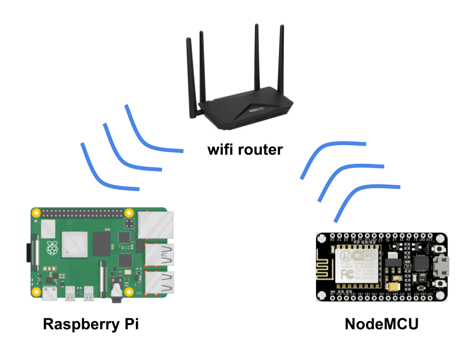

# Simple-NodeMCU-temperature-sensor
<br>

## About

<br>




This project is an example of how to build a simple remote temperature sensor that works over a local wifi network. The sensor is based on a NodeMCU board that connects to a local wifi network and sends data (temperature and humidity) at a specified interval (e.g. every 10 minutes) to a Raspberry Pi located on the same network.

<br>

## Installation

There are two folders in the ```"script"``` folder: ```NodeMCU``` and ```RasPi```. In the ```NodeMCU``` folder there is a sript created in Arduino Programming Language, which we upload to the NodeMCU via the Arduino IDE. Then connect the DHT22 sensor to the board according to the wiring diagram below:
<br>


<br>

After that connect the NodeMCU to the power supply and find the IP address of the board in the local wifi network (we can use the administration tools of the wifi router or ```nmap``` for this). We can check if the sensor works by entering the IP address of NodeMCU + "/temp" in the web browser.
Example:
```
192.168.1.123/temp
```

In the browser, we should see the values of the temperature and humidity respectively, example: ```21.30&68.60```.


Then we copy the script file located in the ```RasPi``` folder to our Raspberry Pi (or another Linux computer) which is connected to the same wifi network. With the command ```crontab -e``` in the terminal we set up the cron job that will run the script at the specified interval. In this case, it is 10 minutes.
```
*/10 * * * * /path/to/script/data_logger.py
```

All data is saved in a CSV file locally on the Raspberry Pi.
<br>


<br>

## Usage

Once set, the programs will run fully automatically. You can easily extend the system with additional NodeMCU sensors that will send data to Raspberry Pi.


